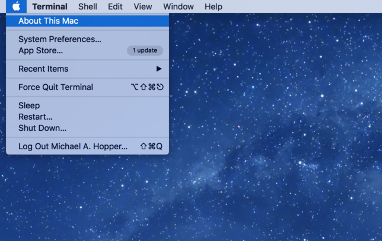
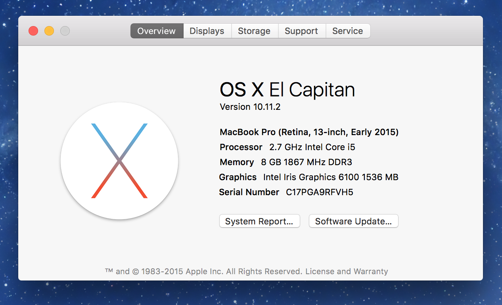
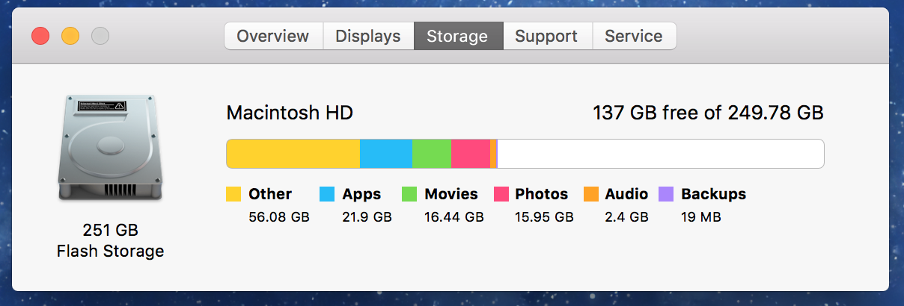
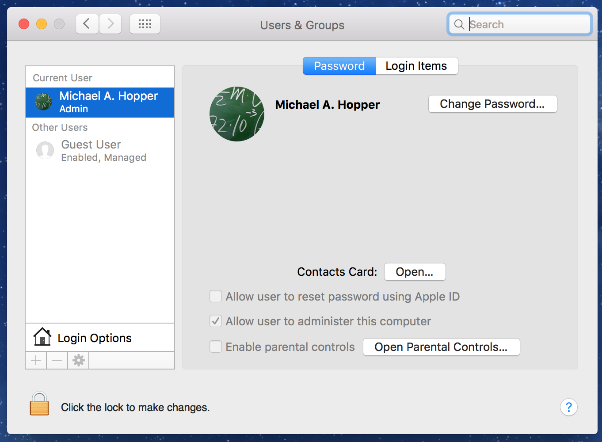

# Student Laptop Requirements and Setup

## Laptop Machine

We highly recommend a MacBook, MacBook Pro, or MacBook Air with at least 4GB of memory (8GB is even better) and 100GB of free storage space.

We also recommend being on a recent version of MacOSX (a version released in the last 12 months) because many of the 3rd party and open source software that we will be installing and using requires a recent version of MacOSX.

You can check your Mac Laptop via the desktop "Apple" menu:



The overview tab will show you the version of MacOSX you are running as well as your display, processor, and the amount of main memory (RAM) installed in your laptop.



The storage tab will show you how much available storage you have. We will be installing a _lot_ of software over the 12 week class so you will need approximately 100GB of available storage space.



## Administrater Rights

You will need to have _administrative_ rights on your laptop. You can check this by going to _System Preferences_ => _Users and Groups_ and selecting your account on the left side of the dialog. The option _Allow user to administer this computer_ should be checked:



## Login and Shell

We will be using the _Terminal_ a lot in this class to install software, create directories, manage GIT repositories, and perform other tasks. The _Terminal_ will launch your default _shell_ which should be the _BASH_ shell.

To check your default shell, open the _Terminal_ app (you can use Spotlight) and at the prompt type:

```bash
echo $SHELL
```

And you should get the following response:

```bash
/bin/bash
```

## BASH Configuration

We will be using two files to configure our BASH Shell: .bash_profile and .bashrc.

Below are examples of these files.

### .bash_profile

```bash
echo "Hello from .bash_profile"

export PATH=/bin:/sbin:/usr/bin:/usr/sbin:~/bin

alias path='echo -e ${PATH//:/\\n}'

[[ -r ~/.bashrc ]] && . ~/.bashrc
```

### .bashrc

```bash
echo "Hello from .bashrc"
```

### Why Two Configuration Files?

You can put configuration settings in either `.bash_profile` or `.bashrc`. The only difference between these two files is that:

* `.bash_profile` is executed when you login.
* `.bashrc` is used for non login shells (i.e. shells that are launched to run a script or a background process).

Since we often put settings in `.bashrc` that we also want to be set in a login session, we source the `.bashrc` file from the `.bash_profile` file.

## Other Useful Hacks

* Add OneTab Chrome Plugin
* Setup a nice bash prompt
  - Liquid Prompt
* Setup some Git aliases for the _longer_ Git commands (via ~/.gitconfig), for example:

```
[alias]
  g  = log --graph --all --branches --decorate --pretty=format:'[%C(auto)%h%Creset][%C(cyan)%an %ar%Creset]%C(auto)%d%Creset %s %C(auto)%Creset'
  ls = log --stat --all --decorate
```
